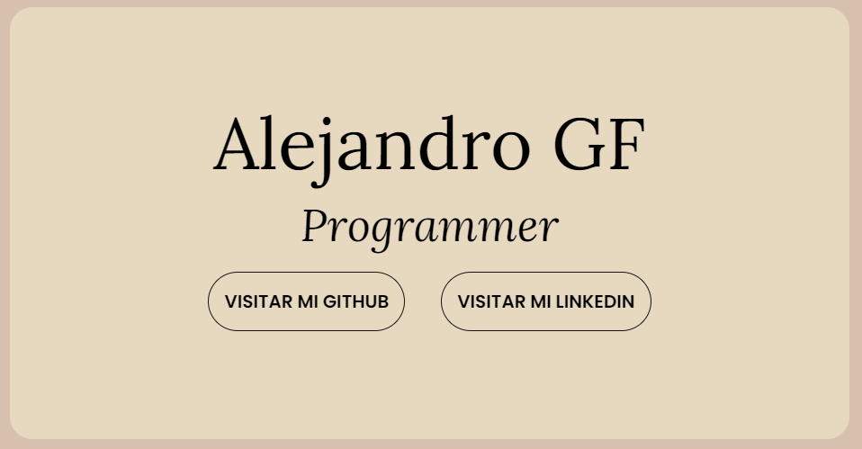

# Portfolio web AGF

## Descripción 📑

Este es mi portfolio web hecho con html y css con información relevante sobre mí sobre programación
Se irá mejorando con el tiempo 😎👌

## Ejemplo en vivo

- [URL de github pages de este proyecto](https://alejancodegf.github.io/mi-portfolio/)

## Tecnologías 🛠

## Autor ✒️

**Alejandro Gómez Fernández**

## Datos de contacto

- **alejan.gomez.fernandez@gmail.com**
- [LinkedIn](https://www.linkedin.com/in/tu-url-de-linkedin/)
